# Project output

Generated assets and static exports for the ITC redesign prototype.

## Folders

| Folder | Description |
|--------|-------------|
| **[`website/`](website/)** | **Full static HTML export** of all 31 pages (open `website/index.html` or run `npx serve output/website`) |
| [`brands/`](brands/) | 15 Python-generated World of Brands product images |
| [`site-images/`](site-images/) | Hero, logo, news & sustainability photos |

## Regenerate everything

```bash
npm run brands:images      # brand + site image copies
npm run export:website     # full static website → output/website/
```

## Brand previews

| Brand | Preview |
|-------|---------|
| Sunfeast | 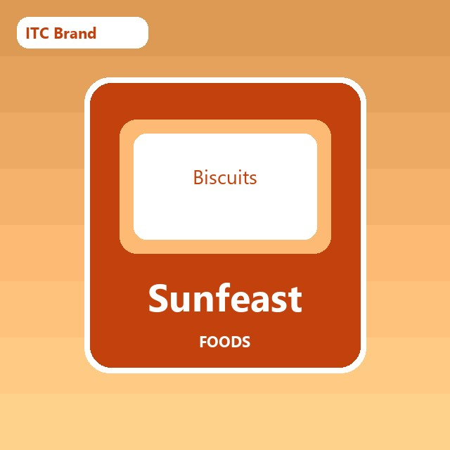 |
| Aashirvaad | 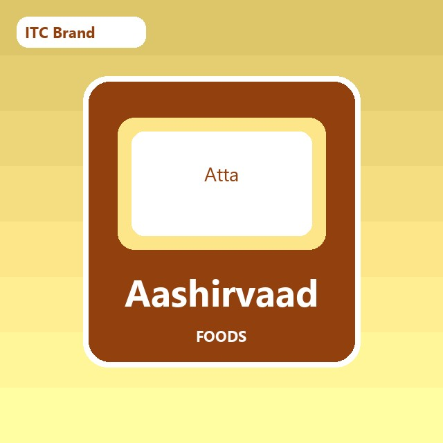 |
| Yippee! | 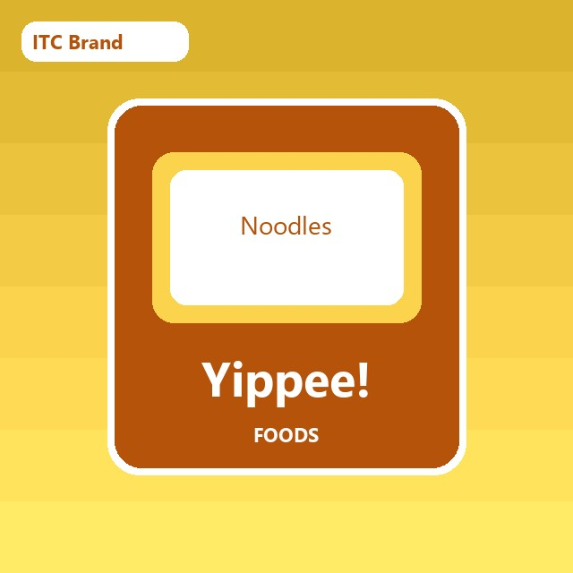 |
| Bingo! | 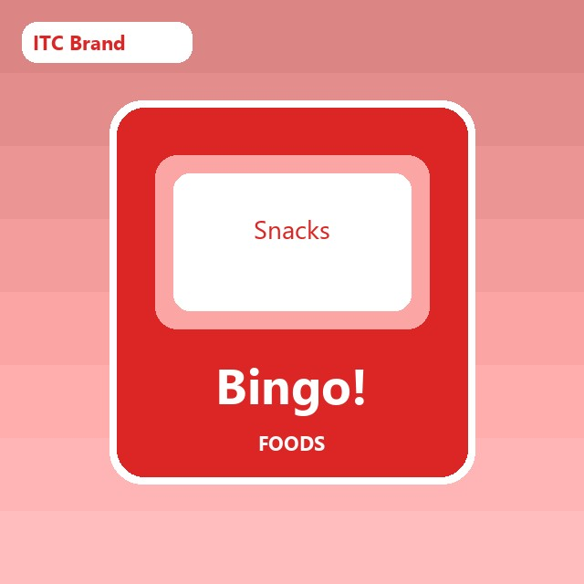 |
| Farmlite | 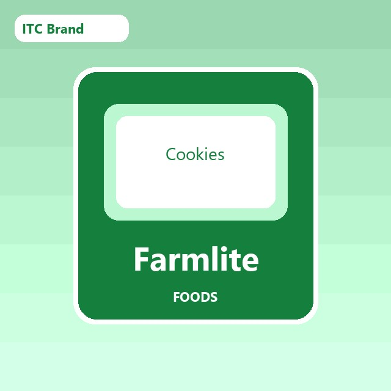 |
| Mom's Magic | 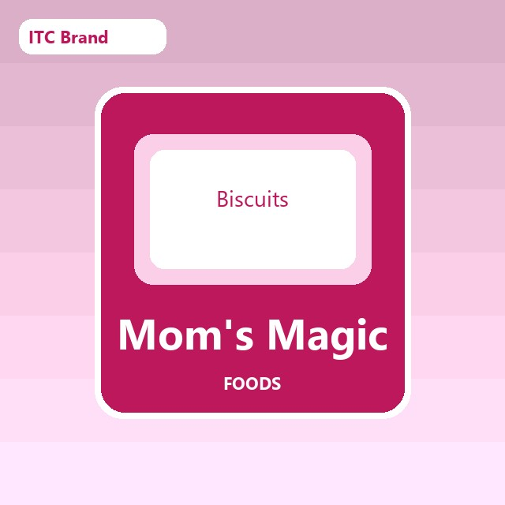 |
| Candyman | 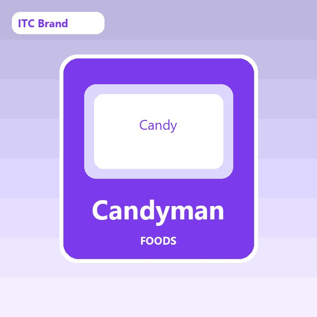 |
| Fiama | 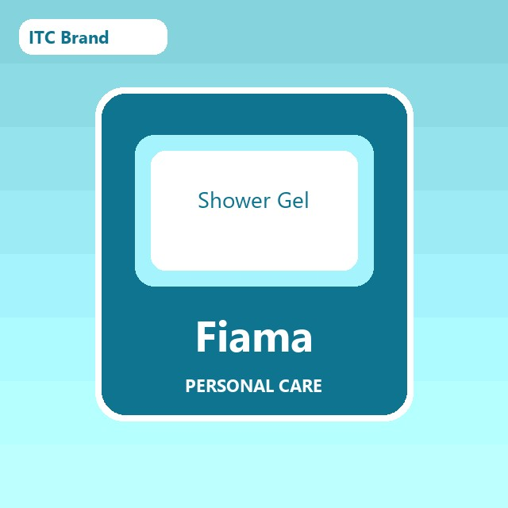 |
| Vivel |  |
| Engage | 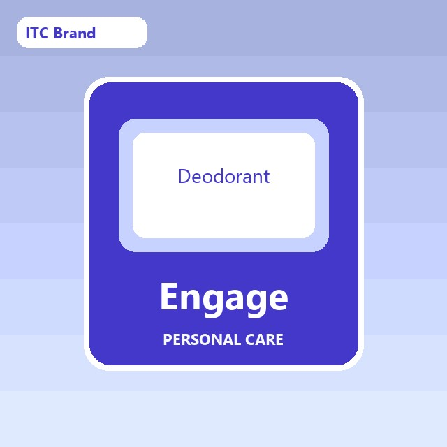 |
| Classmate | 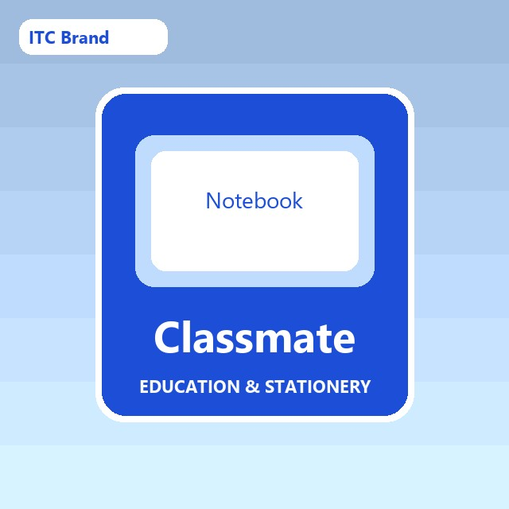 |
| Paperkraft | 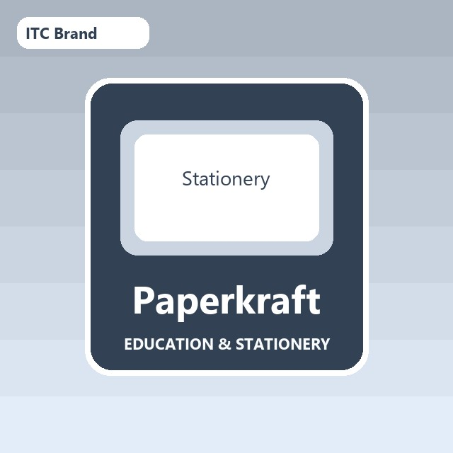 |
| Nimyle | 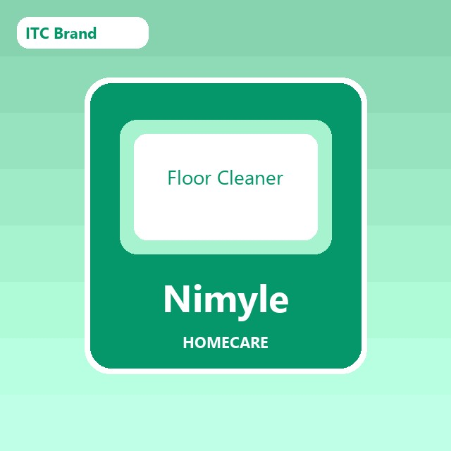 |
| Mangaldeep | 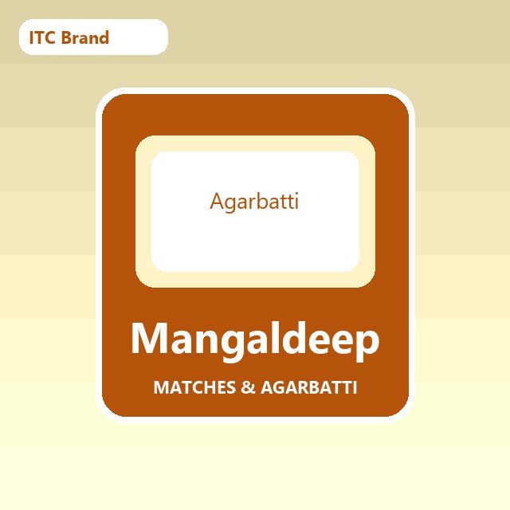 |
| AIM | 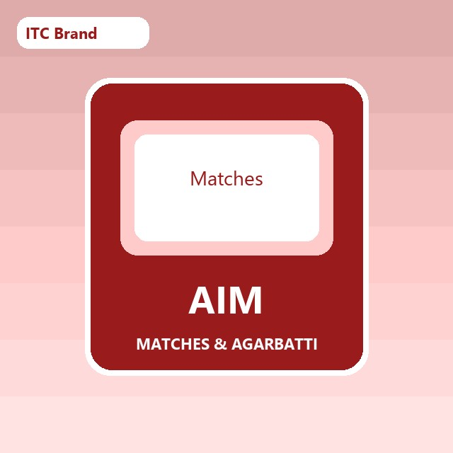 |
